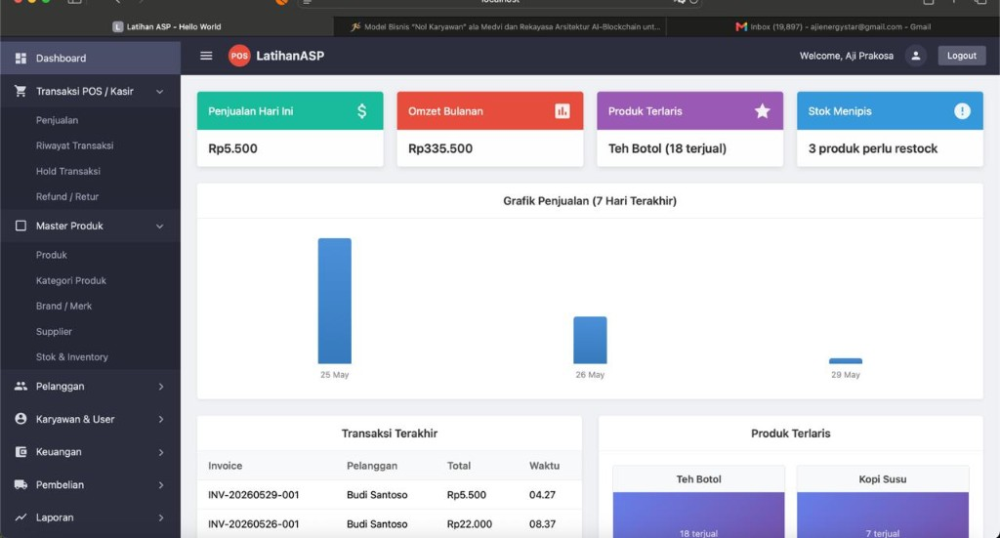
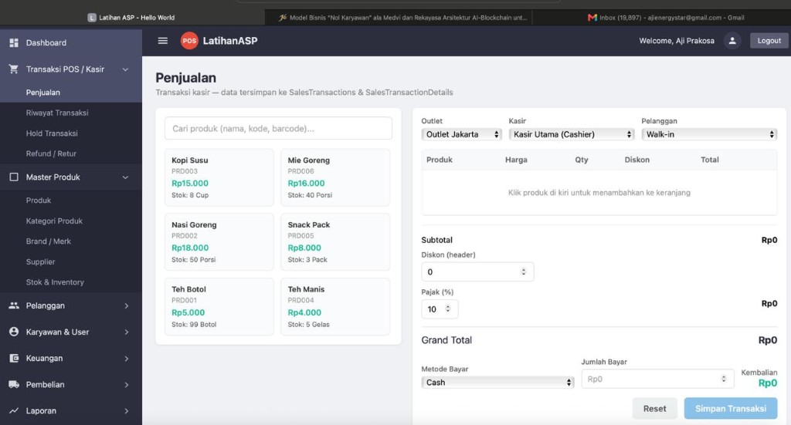
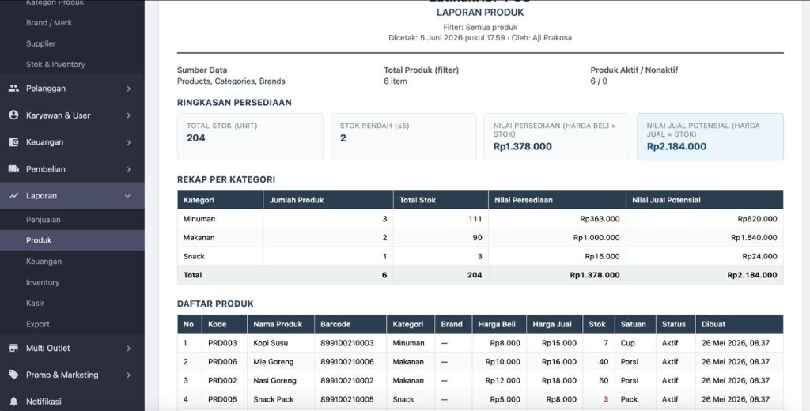

# LatihanASP — POS Web Full Stack

Aplikasi **Point of Sale (POS)** berbasis web untuk transaksi kasir, manajemen produk, inventori, pelanggan, keuangan, dan laporan. Dibangun dengan:

- **Backend:** ASP.NET Core (C#) Web API — Clean Architecture
- **Frontend:** React.js + HTML + CSS (Vite)
- **Database:** SQL Server
- **Container:** Docker & Docker Compose

## Demo

### Dashboard
Ringkasan penjualan harian, omzet bulanan, produk terlaris, stok menipis, grafik 7 hari terakhir, dan transaksi terbaru.



### Penjualan (Kasir)
Halaman kasir: pilih produk, keranjang, diskon, pajak, metode bayar, dan simpan transaksi ke `SalesTransactions` & `SalesTransactionDetails`.



### Laporan Produk
Rekap persediaan per kategori, nilai stok, stok rendah, dan daftar produk lengkap (siap cetak).



## Fitur Utama

| Modul | Keterangan |
|-------|------------|
| **Auth** | Sign up, sign in, forgot/reset password (SMTP) |
| **Dashboard** | KPI penjualan, grafik, transaksi terakhir |
| **POS / Kasir** | Penjualan, riwayat, hold, refund |
| **Master Produk** | Produk, kategori, brand, supplier, stok |
| **Pelanggan** | Data pelanggan, membership, loyalty |
| **Keuangan** | Kas & bank, pengeluaran, hutang/piutang, pajak |
| **Pembelian** | PO, penerimaan barang, retur |
| **Laporan** | Penjualan, produk, keuangan, inventory, kasir, export |
| **Lainnya** | Multi outlet, promo, notifikasi, pengaturan |

## Struktur Folder

```
LatihanASP/
├── backend/
│   ├── src/
│   │   ├── Presentation/     # Controllers, Middleware, Program.cs
│   │   ├── Application/      # DTOs, Services, Validators, Interfaces
│   │   ├── Domain/           # Entities, Common, Repository & Service Ports
│   │   └── Infrastructure/   # Repositories, Persistence, Identity, Email
│   └── LatihanASP.sln
├── frontend/         # React + HTML + CSS
├── database/         # SQL Server scripts
├── docker-compose.yml
└── README.md
```

### Backend — Clean Architecture

| Layer | Tanggung jawab |
|-------|----------------|
| **Presentation** | HTTP endpoints, middleware, DI composition |
| **Application** | Use cases, validators, DTOs, service & repository ports (POS) |
| **Domain** | Entities, `ServiceResult<T>`, auth & infrastructure ports |
| **Infrastructure** | SQL Server repositories, BCrypt, SMTP, connection factory |

## Menjalankan dengan Docker

```bash
cd LatihanASP
docker compose up --build
```

### Error: `lookup registry-1.docker.io: no such host`

Docker Desktop tidak bisa mengakses Docker Hub (DNS/jaringan). Pilih salah satu:

**Opsi A — Tanpa build ulang (image sudah ada):**
```bash
docker compose up -d --no-build
```

**Opsi B — Build frontend di komputer, pakai image lokal:**
```bash
cd frontend && npm run build && cd ..
docker compose -f docker-compose.yml -f docker-compose.offline.yml up -d --build web
docker compose up -d api
```

**Opsi C — Perbaiki DNS Docker Desktop:** Settings → Docker Engine, tambahkan:
```json
"dns": ["8.8.8.8", "1.1.1.1"]
```
Lalu **Restart** Docker Desktop, lalu `docker compose up --build` lagi.

**Opsi D — Development tanpa Docker untuk web:**
```bash
cd frontend && VITE_API_URL=http://localhost:8080 npm run dev
```

Buka browser:

- **Frontend:** http://localhost:3000
- **Backend:** http://localhost:8080/api/dashboard

## Menjalankan tanpa Docker (development)

**Backend:**

```bash
cd backend/src/Presentation
dotnet run
```

API berjalan di http://localhost:5000 (atau port di `launchSettings.json`).

**Frontend:**

```bash
cd frontend
npm install
VITE_API_URL=http://localhost:5000 npm run dev
```

Buka http://localhost:5173

## Konfigurasi Email (Reset Password)

Reset password **mengirim email sungguhan** via SMTP. Edit `backend/src/Presentation/appsettings.Development.json`:

```json
"Email": {
  "Host": "smtp.gmail.com",
  "Port": 587,
  "EnableSsl": true,
  "UserName": "akun-smtp-anda@gmail.com",
  "Password": "app-password-dari-google",
  "FromName": "LatihanASP"
}
```

**Penerima email** = alamat yang diinput di form Forgot Password (bukan hardcode di config).  
**Pengirim (From)** = akun SMTP di `UserName`.

**Gmail:** aktifkan 2FA → buat [App Password](https://myaccount.google.com/apppasswords) → paste di `Password`.

**Alternatif testing:** gunakan [Mailtrap](https://mailtrap.io) (SMTP sandbox, email tidak ke inbox asli tapi mudah dicek).

Setelah konfigurasi, restart API. Link reset mengarah ke `/reset-password?token=...`.

## Database (SQL Server)

Database **LatihanASP_DB** berisi tabel: `users`, `password_resets`, `user_sessions`, `email_verifications`.

```bash
docker compose up -d sqlserver
docker compose run --rm db-init
```

Koneksi: `localhost,1433` · database `LatihanASP_DB` · user `sa` · password `LatihanASP@2026!`

Detail skema: lihat [database/README.md](database/README.md) dan [database/init.sql](database/init.sql).

## Halaman Web (Auth)

| Halaman | URL |
|---------|-----|
| Sign In | http://localhost:3000/signin |
| Sign Up | http://localhost:3000/signup |
| Forgot Password | http://localhost:3000/forgot-password |
| Home | http://localhost:3000/home |

## Endpoint API

| Method | URL | Keterangan |
|--------|-----|------------|
| GET | `/api/hello` | Hello World |
| POST | `/api/auth/signup` | Daftar akun baru |
| POST | `/api/auth/signin` | Login |
| POST | `/api/auth/forgot-password` | Reset password |
| GET | `/api/auth/me` | Profil user (Bearer token) |
| POST | `/api/auth/logout` | Logout |
